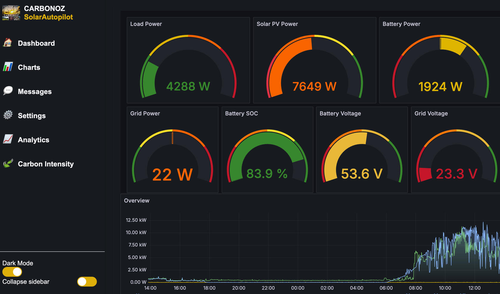

# CARBONOZ SolarAutopilot

## Home Assistant Add-on: CARBONOZ SolarAutopilot

CARBONOZ Solar Autopilot is the dashboard of your choice for every day use of your Hybrid Solar system. We offer easy to use data logging, analytics, CO2 avoidance and powerful export features. Solar Autopilot is your first line of defence against overconsuming devices, drowning batteries and cloudy days. Manage easy to setup templates, automations and alerts by setting up event triggers. Solar Autopilot is available via Home Assistant Add-On Store so you can still benefit from the many other Home Assistant IoT integrations, features and automations available.

### 🌱 Environmental Impact & CO2 Offsetting

CO2 offsetting is a strategy used to mitigate the impact of greenhouse gas emissions by compensating for them through activities that reduce or remove an equivalent amount of CO2 from the atmosphere. This can include investing in renewable energy projects, reforestation, or other sustainability initiatives. By contributing to CO2 offsets, individuals and businesses can play a significant role in addressing climate change and achieving global carbon neutrality goals.

For solar system owners, CO2 offsetting is particularly relevant. Solar energy systems generate clean, renewable energy, reducing the need for electricity from fossil fuel-powered plants. Each kilowatt-hour (kWh) of solar energy produced prevents the release of a measurable amount of CO2 into the atmosphere. By tracking their system's energy output, solar owners can calculate the amount of CO2 their system offsets and leverage this data for economic and environmental benefits.

Create your own account under  [[https://login.carbonoz.com](https://login.carbonoz.com)/] to become part of our movement to log your electricity production. This also offers you valuable system optimisation advice and make your CO2 offsets marketable. Soon we will offer paybacks for your CO2 offset evidence (under development).

  

### 📚 Documentation

For complete documentation, visit:
[CARBONOZ Documentation](https://docs.carbonoz.com)

### 🤝 Support

Need help? Reach out to us:
- [GitHub Issues](https://github.com/CARBONOZ-RENEWABLES/solarautopilot/issues)
- [Community Forum](https://login.carbonoz.com)
- [Email Support](mailto:support@carbonoz.com)

